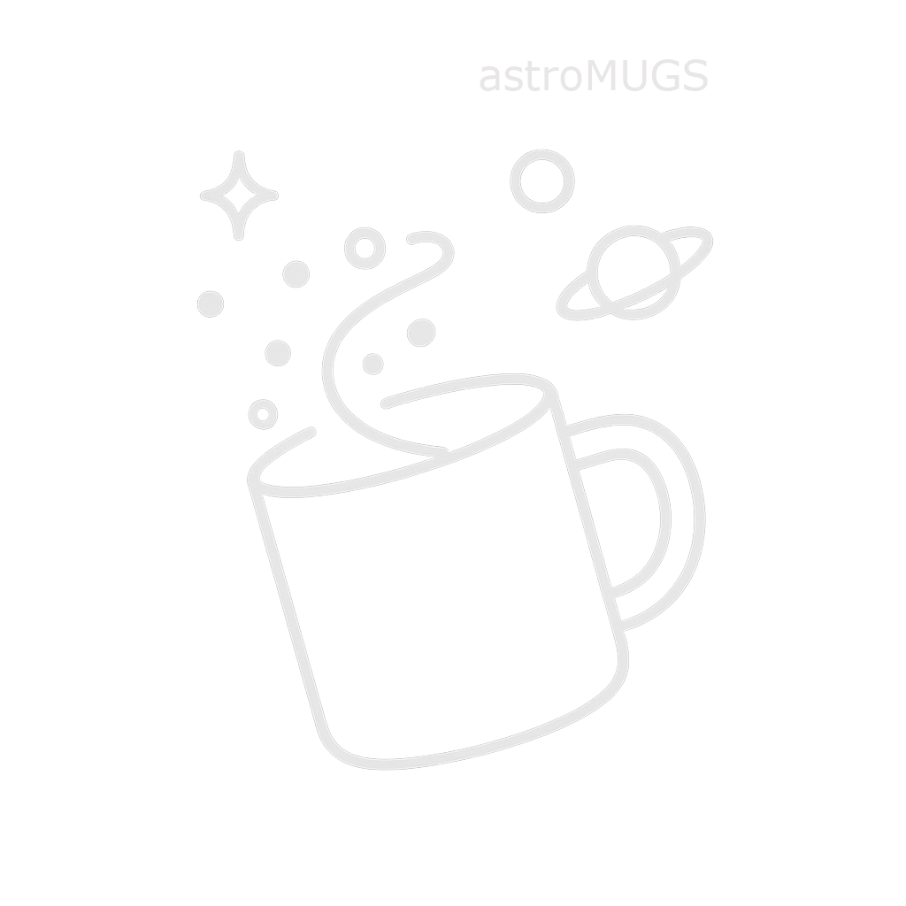

<picture>
  <source srcset="docs/source/_static/logo-dark-name.png" media="(prefers-color-scheme: dark)">
  <source srcset="docs/source/_static/logo-light.png" media="(prefers-color-scheme: light)">
  
</picture>

# A code for MUlti-Grain Simulations (MUGS) dedicated to young stellar objects. 

A modular and user-friendly pipeline to couple MHD, radiative transfer, and chemistry simulations. 
The code can convert RADMC3D input/output files to a NAUTILUS friendly format, and vice-versa. 
astroMUGS is the new version of the library chemdiskpy.

## Installation

- You can find the latest release from test PYPI (for now) [https://test.pypi.org/](https://test.pypi.org/):

        pip install -i https://test.pypi.org/simple/ astromugs

- Alternatively, you can clone the repository:

        git clone https://github.com/sachagavino/astroMUGS.git

## Documentation
A detailed documentation can be found [here][1]. 

[1]: https://astromugs.readthedocs.io/en/latest

